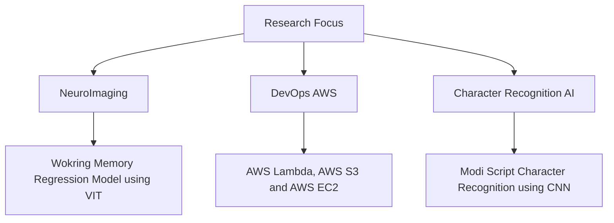

  
# DEVANSH SINHA

---

  

Harnessing AI and data science to solve real-world challenges, driving innovation across industries through intelligent, scalable, and high-impact solutions.  

  
 
##  Education & Achievements
 

 
- *Georgia State University*, Atlanta, GA  
   B.S. in Computer Science & Data Science (May 2025)  
   GPA: 4.14/4.3  
   8 President's List Honor
  
- 1st Price in Undergraduate Research Conference.

  
---
 
##  Technical Skills
 

 
### Core Technologies

### Frameworks & Libraries

 
### Infrastructure & Tools

 
### Additional Expertise
 
SQL, NoSQL, LangChain, Scrum (Agile), MongoDB
Generative AI, NLP, LLM

AWS, GCP, Azure, and REST API.

 

##  Current Areas of Research

 
---
 
## Projects
 
### AI Chatbot with OpenRouter and Text-to-Speech
*Full-stack chatbot with Conversational AI and Voice Synthesis*
- Integrated OpenRouter/OpenAI for conversational AI
- Implemented Google Cloud Text-to-Speech for voice output
- Built with Next.js, React Server Components, and FFmpeg for audio processing

###  Corneal Pathology Classification  
*AI-Powered Classification for Ophthalmology*  
-  Trained YOLOv8 and ResNet50 for corneal severity detection  
-  Mask R-CNN for cornea segmentation  
-  Achieved high accuracy in ulcer grading  

###  StylePitch  
*AI-Driven Fashion Validation Platform*  
-  Developed a cross-platform mobile application using React Native, Node.js, and Firebase  
-  Enabled designers to showcase ideas with a voting system, reducing fashion waste by 50%.
-  Provided valuable feedback loops to improve sustainable fashion trends  

###  Beesafe-AI  
*Secure AI-Powered Password Manager*  
- ️ Integrated Google’s Gemini AI for intelligent password generation  
-  Implemented two-step authentication for enhanced security  
- ☁️ Hosted on AWS Amplify with Django backend and React frontend  

###  Bank-CD Predictor  
*Predicting Customer Enrollment in Certificates of Deposit*  
-  Built an end-to-end ML pipeline for financial predictions  
-  Achieved 91% ROC-AUC by optimizing feature engineering and model tuning 
- ️ Deployed using AWS, Docker, and GitHub Actions for CI/CD
  
###  RNAseq Analysis  
*Bioinformatics Pipeline for Differential Gene Expression*  
-  Python & R-based statistical modeling  
-  Analyzed differential gene expression  
-  Implemented PCA and clustering techniques for further analysis
---
 
##  Computer Science Courses
Principal of Computer Science, Discrete Math, Data Structures & Algorithms, Programming Level Concepts, Operating Systems, Software Engineering, System Level Programming, Computer Organization & Programming .

##  Data Science Courses
Fundamentals of Data Science, Machine Learning, Big Data Programming, Data Mining
